# Input Viewer Architecture

## Diagram

```mermaid
%%{init: {'theme': 'dark', 'themeVariables': { 'primaryColor': '#1f1f1f', 'primaryTextColor': '#fff', 'primaryBorderColor': '#58a6ff', 'lineColor': '#58a6ff', 'secondaryColor': '#006100', 'tertiaryColor': '#fff'}}}%%

flowchart TB
    subgraph Entry["Entry Point"]
        main["__main__.py<br/>CLI & App Init"]
    end

    subgraph Core["Core Components"]
        viewer["viewer.py<br/>DualVideoViewer<br/>(Main Window)"]
        camera["camera.py<br/>CameraFeed<br/>(Video Capture)"]
        detection["detection.py<br/>NoSignalDetector<br/>(Template Matching)"]
        config["config.py<br/>Settings & Constants"]
    end

    subgraph Utilities["Utilities"]
        log["log.py<br/>Colored Logging"]
        utils["utils.py<br/>Path Helpers"]
    end

    subgraph Widgets["widgets/"]
        overlays["overlays.py<br/>• InputNameOverlay<br/>• InfoPanel<br/>• InfoIcon<br/>• ScreenSaver"]
        settings["settings_panel.py<br/>SettingsPanel<br/>(Input Config)"]
        audio["audio_panel.py<br/>AudioPanel<br/>(Volume Control)"]
        thumbnails["thumbnails.py<br/>ThumbnailsPanel<br/>(Input Selection)"]
        toggle["toggle_switch.py<br/>ToggleSwitch"]
    end

    subgraph External["External Dependencies"]
        pyqt["PyQt6<br/>(GUI Framework)"]
        opencv["OpenCV (cv2)<br/>(Video Processing)"]
        numpy["NumPy<br/>(Array Operations)"]
    end

    subgraph IO["I/O"]
        cameras[("Capture Cards")]
        settingsfile[("settings.json")]
        assets[("assets/<br/>• logo.png<br/>• no_source.png")]
    end

    %% Entry flow
    main --> viewer

    %% Core relationships
    viewer --> camera
    viewer --> config
    camera --> detection
    detection --> config

    %% Widget usage
    viewer --> overlays
    viewer --> settings
    viewer --> audio
    viewer --> thumbnails
    settings --> toggle

    %% Utility usage
    viewer --> log
    camera --> log
    detection --> log
    config --> log
    detection --> utils
    config --> utils

    %% External dependencies
    viewer --> pyqt
    camera --> pyqt
    camera --> opencv
    detection --> opencv
    detection --> numpy
    overlays --> pyqt
    settings --> pyqt
    audio --> pyqt
    thumbnails --> pyqt

    %% I/O connections
    camera --> cameras
    config --> settingsfile
    detection --> assets
    viewer --> assets

    %% Styling
    classDef entryClass fill:#2d5a2d,stroke:#58a6ff,stroke-width:2px
    classDef coreClass fill:#1a3a5c,stroke:#58a6ff,stroke-width:2px
    classDef widgetClass fill:#3d3d1a,stroke:#ffcc00,stroke-width:2px
    classDef utilClass fill:#3d1a3d,stroke:#cc66ff,stroke-width:2px
    classDef extClass fill:#1a1a1a,stroke:#888,stroke-width:1px
    classDef ioClass fill:#1a2a3a,stroke:#4a9eff,stroke-width:1px

    class main entryClass
    class viewer,camera,detection,config coreClass
    class overlays,settings,audio,thumbnails,toggle widgetClass
    class log,utils utilClass
    class pyqt,opencv,numpy extClass
    class cameras,settingsfile,assets ioClass
```

## Overview

Input Viewer is a lightweight video input viewer - OBS without the complexity. It displays video capture feeds with configurable layouts and various overlay features.

## Entry Point

| Module | Purpose |
|--------|---------|
| `__main__.py` | Parses CLI arguments (`--mock`, `--verbose`, `--switch-signals`, `--no-signal`) and initializes the PyQt6 application |

## Core Components

| Module | Class | Purpose |
|--------|-------|---------|
| `viewer.py` | `DualVideoViewer` | Main widget - manages layout modes (dual/single left/single right), keyboard shortcuts, cursor hiding, and coordinates all UI components |
| `camera.py` | `CameraFeed` | Handles video capture from capture cards via OpenCV with platform-specific backends (AVFoundation on macOS, DirectShow on Windows, V4L2 on Linux). Supports mock mode for testing |
| `detection.py` | `NoSignalDetector` | Uses multi-scale template matching to detect "no signal" screens from capture cards. Includes quick-check optimizations to reduce CPU usage |
| `config.py` | - | Configuration management - loads/saves `settings.json`, defines constants (resolution, margins, intervals), manages input configurations |

## Widgets (`widgets/`)

| Module | Class(es) | Purpose |
|--------|-----------|---------|
| `overlays.py` | `InputNameOverlay`, `InfoPanel`, `InfoIcon`, `ScreenSaver` | Visual overlays for input name display, keyboard shortcuts info, and screensaver with logo |
| `settings_panel.py` | `SettingsPanel` | Configure input names, enable/disable inputs, set default input |
| `audio_panel.py` | `AudioPanel`, `AudioIcon` | Volume sliders and mute controls for input and system audio |
| `thumbnails.py` | `ThumbnailsPanel` | Quick input selection grid showing thumbnails of all inputs |
| `toggle_switch.py` | `ToggleSwitch` | Reusable animated toggle switch component |

## Utilities

| Module | Class/Functions | Purpose |
|--------|-----------------|---------|
| `log.py` | `Log` | Colored terminal output with verbose mode support. Methods: `info()`, `success()`, `warning()`, `error()`, `debug()`, `header()` |
| `utils.py` | `get_resource_path()`, `get_user_data_path()` | Handles PyInstaller bundling paths and platform-specific user data directories |

## External Dependencies

- **PyQt6** - GUI framework for all widgets and window management
- **OpenCV (cv2)** - Video capture and image processing
- **NumPy** - Array operations for frame manipulation and detection algorithms

## Data Flow

1. **Startup**: `__main__.py` parses args → creates `QApplication` → instantiates `DualVideoViewer`
2. **Video Capture**: `DualVideoViewer` creates two `CameraFeed` instances → each opens a capture card via OpenCV
3. **Frame Loop**: Timer triggers `update_frame()` → reads frames from `CameraFeed` → checks for no-signal via `NoSignalDetector` → displays in labels
4. **User Interaction**: Keyboard/mouse events handled by `DualVideoViewer` → toggles overlays, switches inputs, changes layout modes
5. **Settings**: `SettingsPanel` reads/writes via `config.py` → persists to `settings.json`

## Keyboard Shortcuts

| Key | Action |
|-----|--------|
| `D` | Dual view (both feeds) |
| `L` | Single view: left feed |
| `R` | Single view: right feed |
| `1-4` | Select input directly |
| `T` | Show thumbnails panel |
| `Space` | Freeze frame |
| `A` | Toggle auto-switch |
| `F11` / `F` | Toggle fullscreen |
| `Q` / `Escape` | Quit |
